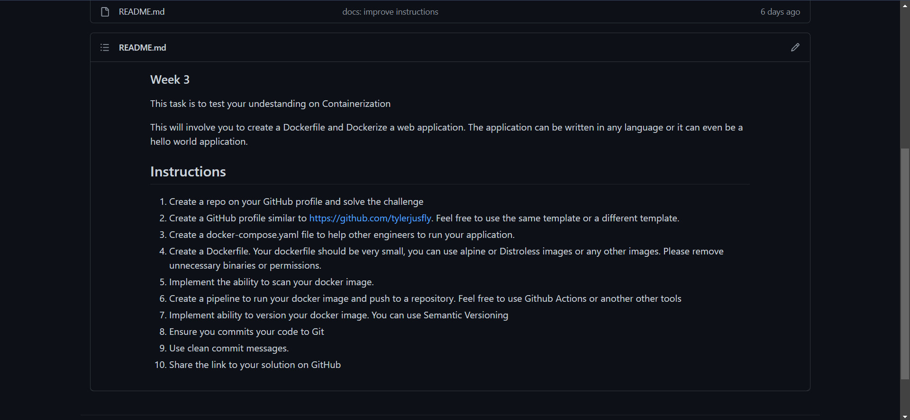
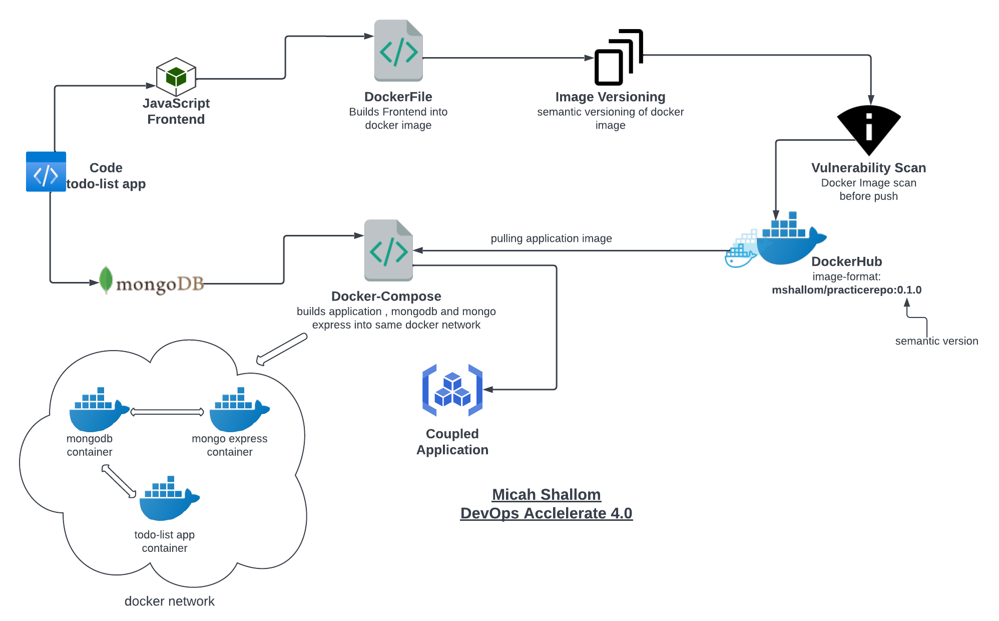
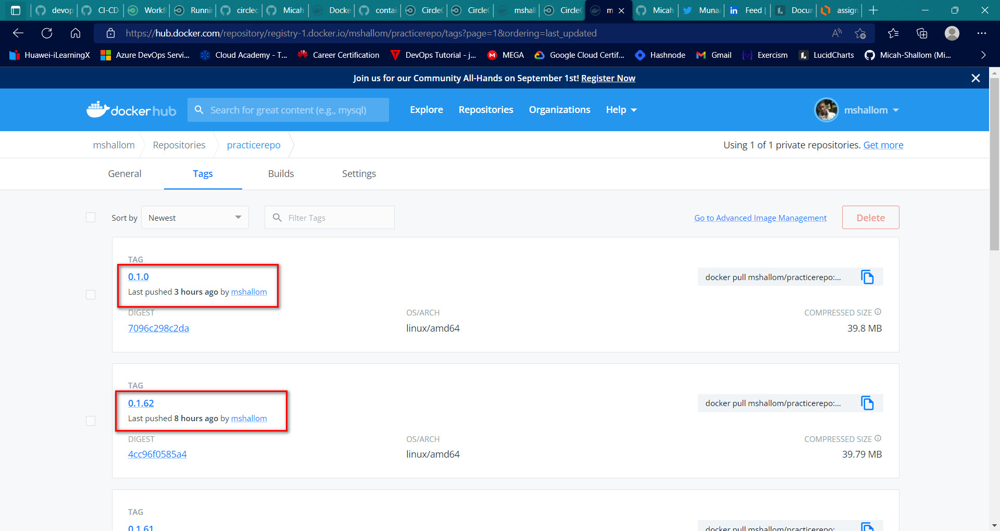
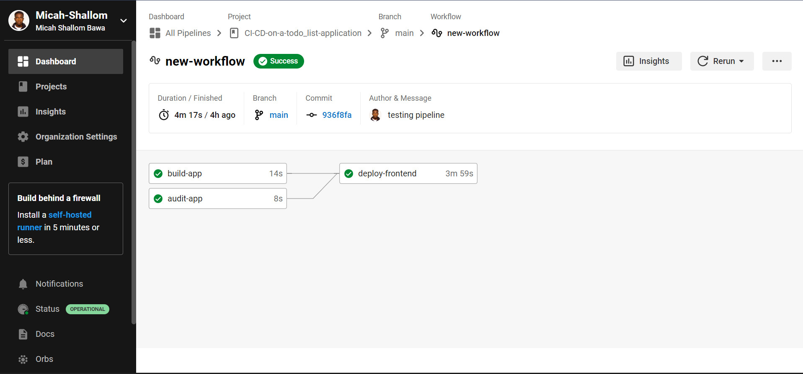
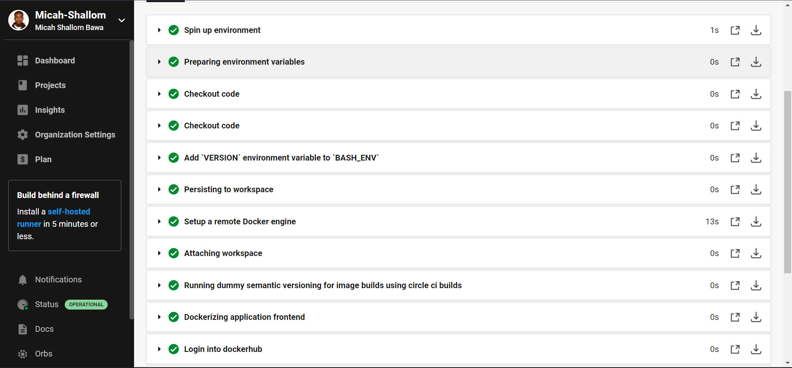

# CI-CD On a TODO List Application

# My Solution

### <u>Searched online for a todo-list application and completed the task</u>
Source code source:

https://github.com/nlharri/simple-todo-app-mongodb-express-node

### <u>Designed solution architecture for project</u>

### <u>Pushed Image to dockerhub</u>

